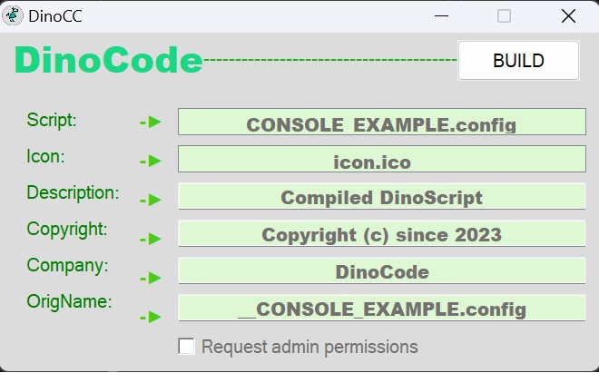

## INFO
   > .CONFIG ---> .EXE

   The compiled DinoCode Scripts are previously optimized, and include their own interpreter adapted to these optimizations (being slightly different from the general version). The .EXE produced can be distributed to any 64-bit Windows 7+ machine.

## GUI
   > If no console parameters are used, a simple configurable interface will be displayed to allow compilation.
   > 
   > 
 

   
## CONSOLE
|      Flag     |                      Explain                     |          Example         |
|:-------------:|:------------------------------------------------:|:------------------------:|
|      /in      |               Source file (.CONFIG)              |   /in "example.config"   |
|      /out     |                 Dest file (.EXE)                 |    /out "example.exe"    |
|     /icon     |             Icon (.ICO) for the .EXE             |    /icon "custom.ico"    |
|     /admin    | Enable request for admin permissions in the .EXE |         /admin 1         |
|   /compress   |     Change compression type in the final .EXE    |        /compress 0       |
|  /description |              Additional Information              | /description "Just test" |
|   /copyright  |              Additional Information              |                          |
|  /CompanyName |              Additional Information              |                          |
| /OrigFilename |              Additional Information              |                          |
|     /show     |      Show GUI (Should always go at the end)      |          /show 1         |

## Credits
* Chris Mallett (AHK2EXE)
* AHK Community (Powered some additional features)

## License
> DinoCompiler is distributed under the GNU General Public License version 2.0 (GPLv2). This means that anyone can use, modify and distribute the software as long as they comply with the terms of the license.

  **->** See the [LICENSE](LICENSE ':ignore') file for more information on the license terms and conditions.
